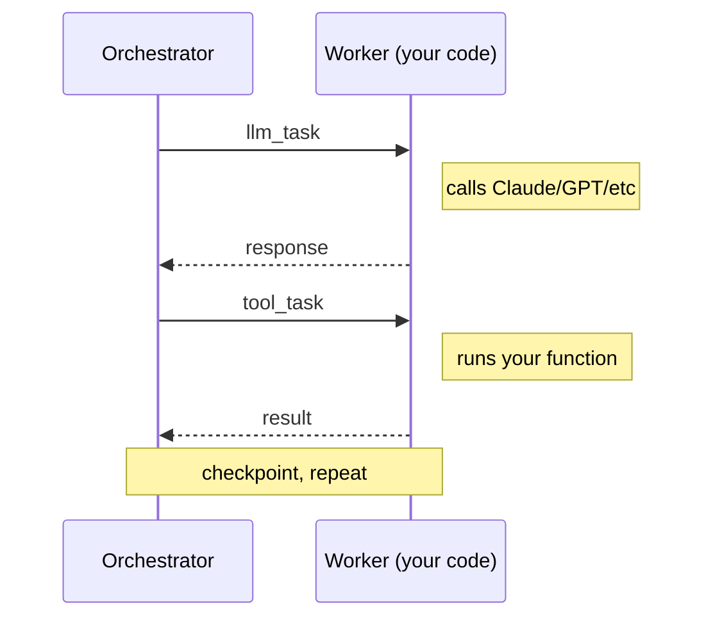

<p align="center">
  
</p>

<h1 align="center">Norns</h1>

<p align="center">
  <a href="https://github.com/nornscode/norns/actions/workflows/ci.yml"></a>
  <a href="LICENSE"></a>
  <a href="https://elixir-lang.org/"></a>
</p>

<p align="center">Durable execution for AI agents</p>

https://github.com/user-attachments/assets/b300b164-dc0c-44ea-a794-1de00b4f01a7

<p align="center"><sub>An agent calls <code>wait</code> (10s) then <code>say_hello</code>. The worker is killed twice mid-run. Each time, a new worker connects and the run resumes from where it left off. No state lost, no duplicate execution.</sub></p>

Norns is an open-source durable runtime for AI agents, built in Elixir on the BEAM. If a worker crashes mid-run, the next worker picks up where it left off. Every step is persisted to an event log. Completed tools don't re-execute. Norns never touches your API keys or data.

## Get started

```bash
brew install nornscode/tap/nornsctl
nornsctl dev
nornsctl new my-agent
cd my-agent
uv sync
uv run my-agent-worker
```

That's it. You have a running Norns server and a connected agent worker. See the [hello example](https://github.com/nornscode/norns-hello-agent) for a full walkthrough.

## The problem

If you run agents locally, durability is a solved problem. Modern operating and file systems and solid state drives are very reliable. Your machine stays on, the process stays alive, and the conversation transcript is right there. Cloud infrastructure is a little different. It's ephemeral, temporary. Containers get evicted. VMs get preempted. Deploys ship new code and kill in-flight processes. An agent's environment can disappear at any moment, and there's no durable file system or long-lived process to fall back on.

Your agent is 8 tool calls deep when the container gets evicted. Without something like Norns, you start over from the beginning. With Norns, the next worker picks up at call 9.

Your payment tool times out and the agent retries. Without idempotency, you risk charging the customer twice. With Norns, the retry skips the completed charge — same idempotency key, same result.

Your agent is halfway through a 20-step research task when a deploy ships. Without durable execution, in-flight runs die. With Norns, runs survive deploys and resume on the new version.

## How it works

The Norns orchestrator is a state machine. It doesn't call LLMs or execute tools. It manages state transitions and persists events. Workers do the actual work.



Workers connect via WebSocket, register their tools and capabilities, and hold all the API keys. If no worker is connected, tasks queue and resume when one reconnects. If a worker dies mid-task, the orchestrator notices and puts the task back in the queue.

Each agent is a GenServer under a DynamicSupervisor — process isolation, crash recovery, and concurrency come from the BEAM. What Norns adds is the orchestration layer: event logs, checkpoints, idempotency, and error classification.

Side-effecting tools get deterministic idempotency keys derived from the run ID, step number, and tool call ID. On replay, if a result already exists for that key, the tool is skipped. Not all errors are the same either — transient failures get retried with backoff, rate limits get patient retries, and validation errors are terminal.

## SDKs and examples

- [Python SDK](https://github.com/nornscode/norns-sdk-python) — `pip install norns-sdk` ([PyPI](https://pypi.org/project/norns-sdk/))
- [Elixir SDK](https://github.com/nornscode/norns-sdk-elixir) — `{:norns_sdk, "~> 0.1"}` ([Hex](https://hex.pm/packages/norns_sdk))
- [CLI (`nornsctl`)](https://github.com/nornscode/nornsctl)
- [Hello example](https://github.com/nornscode/norns-hello-agent)
- [Mimir (full example app)](https://github.com/nornscode/norns-mimir-agent)

### Worker

```python
from norns import Norns, Agent, tool
import os

@tool
def search_docs(query: str) -> str:
    return "..."

agent = Agent(
    name="support-bot",
    model="claude-sonnet-5",
    system_prompt="You are a support assistant.",
    tools=[search_docs],
)

norns = Norns("http://localhost:4000", api_key="nrn_...")
norns.run(agent)
```

### Client

```python
from norns import NornsClient

client = NornsClient("http://localhost:4000", api_key="nrn_...")
result = client.send_message("support-bot", "Where is my order?", wait=True)
print(result.output)
```

## Where this is going

The direction is an agent builder: describe an agent, get a running durable one. The model that makes that possible: **tools are infrastructure, agents are configuration.** Workers form a tenant's long-lived capability layer (the Slack worker, the DB worker); agents are cheap data — prompt, model, tool selection, triggers — composed on top through the API without deploying anything. The near-term roadmap builds the primitives that story needs: per-agent tool selection, cron triggers, inbound webhooks, worker affinity ([gards](docs/gards.md)), and project templates. Everything in this repo stays open source; the builder itself and managed hosting for workers and connectors are planned as a hosted product on top of these primitives. See [docs/roadmap.md](docs/roadmap.md) and [docs/plan-agent-builder.md](docs/plan-agent-builder.md).

## Status

Norns is v0.x. The runtime, SDKs, and CLI work and are in active development. APIs are stabilizing; breaking changes will be noted in releases. Pin versions if you're using this in production.

## License

MIT
