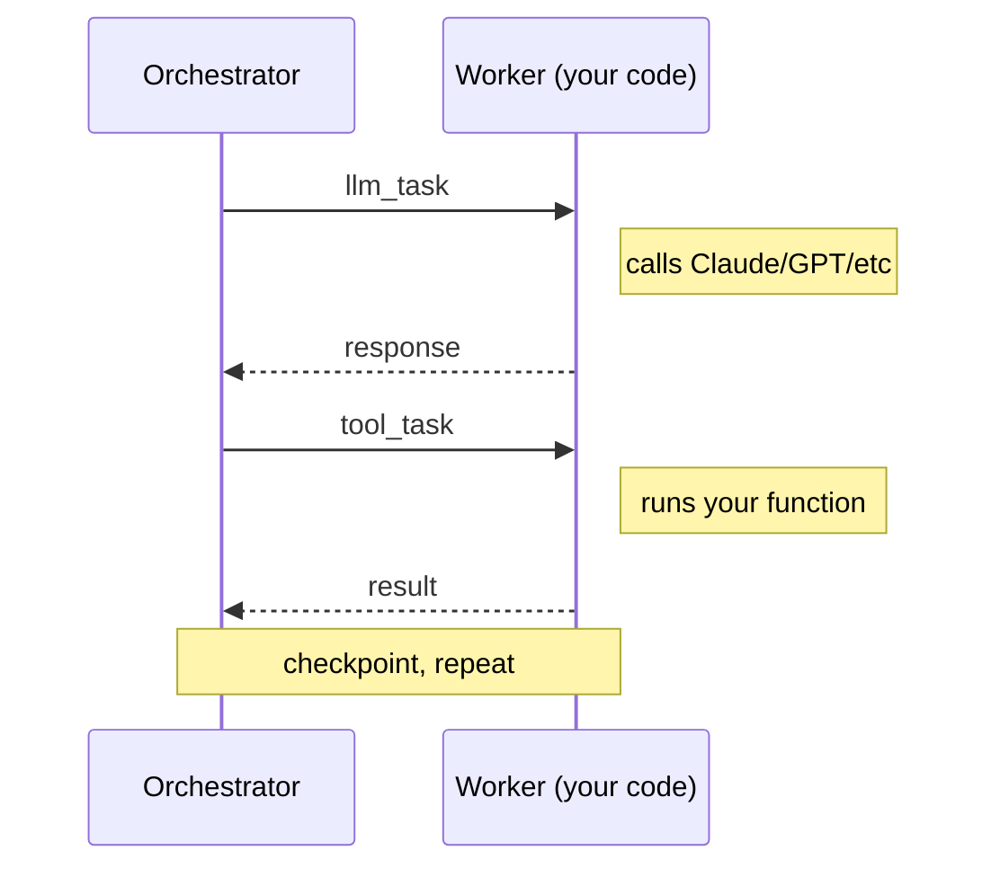

<p align="center">
  
</p>

<h1 align="center">Norns</h1>

<p align="center">
  <a href="https://github.com/nornscode/norns/actions/workflows/ci.yml"></a>
  <a href="LICENSE"></a>
  <a href="https://elixir-lang.org/"></a>
</p>

<p align="center">Durable execution for AI agents</p>

https://github.com/user-attachments/assets/b300b164-dc0c-44ea-a794-1de00b4f01a7

<p align="center"><sub>An agent calls <code>wait</code> (10s), then <code>say_hello</code>. I kill the worker twice mid-run. Each time a new worker connects, the run picks up where it left off. Nothing is lost and nothing runs twice.</sub></p>

Norns is a durable execution runtime for AI agents, built in Elixir on the BEAM. If the worker running an agent dies mid-run, the next worker replays the run's event log and continues from the last completed step. Tools that already ran don't run again. Norns never sees your API keys.

## Get started

```bash
brew install nornscode/tap/nornsctl
nornsctl dev
nornsctl new my-agent
cd my-agent
uv sync
uv run my-agent-worker
```

That gives you a Norns server and a worker connected to it. The [hello agent](https://github.com/nornscode/norns-hello-agent) walks through the rest.

## Why

On your laptop, durability is mostly a solved problem. The process stays up, the disk is reliable, and the transcript is right there. In the cloud, none of that holds. Containers get evicted, VMs get preempted, and every deploy kills whatever was in flight. An agent eight tool calls into a job can lose its whole environment at any moment, with no long-lived process or file system to fall back on.

Norns moves the agent's state out of the process and into Postgres. Every LLM call, tool call, and tool result is an event in the run's log, so the run doesn't live in any one container. When a worker disappears, the next one replays the log and carries on.

## How it works

The orchestrator is a state machine. It never calls an LLM and never runs a tool. It manages state transitions and persists events. Workers do the actual work.



Workers connect over WebSocket, register their tools, and hold the API keys. If no worker is connected, tasks queue until one shows up. If a worker dies mid-task, the orchestrator notices and puts the task back in the queue.

Side-effecting tools get a deterministic idempotency key derived from the run ID, step number, and tool call ID. On replay, if a result already exists for that key, the tool is skipped. That's what keeps a resumed run from sending the same email twice.

Errors get classified, because retrying everything is as wrong as retrying nothing:

- Transient failures (timeouts, worker disconnects, upstream outages) get a few retries with exponential backoff.
- Rate limits get patient retries with linear backoff. The dependency is fine, you just have to wait.
- Validation and policy errors are terminal. Retrying won't fix a bad input.

## SDKs and examples

- [Python SDK](https://github.com/nornscode/norns-sdk-python) — `pip install norns-sdk` ([PyPI](https://pypi.org/project/norns-sdk/))
- [Elixir SDK](https://github.com/nornscode/norns-sdk-elixir) — `{:norns_sdk, "~> 0.1"}` ([Hex](https://hex.pm/packages/norns_sdk))
- [CLI (`nornsctl`)](https://github.com/nornscode/nornsctl)
- [Hello example](https://github.com/nornscode/norns-hello-agent)
- [Mimir (full example app)](https://github.com/nornscode/norns-mimir-agent)

### Worker

```python
from norns import Norns, Agent, tool

@tool
def search_docs(query: str) -> str:
    return "..."

agent = Agent(
    name="support-bot",
    model="claude-sonnet-5",
    system_prompt="You are a support assistant.",
    tools=[search_docs],
)

norns = Norns("http://localhost:4000", api_key="nrn_...")
norns.run(agent)
```

### Client

```python
from norns import NornsClient

client = NornsClient("http://localhost:4000", api_key="nrn_...")
result = client.send_message("support-bot", "Where is my order?", wait=True)
print(result.output)
```

## Where this is going

The goal is an agent builder: describe an agent, get a running durable one. The idea underneath is that tools are infrastructure and agents are configuration. Workers are the long-lived part (the Slack worker, the database worker). Agents are data on top of them: a prompt, a model, a tool selection, some triggers. You create one through the API without deploying anything.

v0.5 shipped the primitives that story needs: per-agent tool selection, cron triggers, inbound webhooks with signature verification, worker affinity ([gards](docs/gards.md)), and project templates. I'm now building a provisioner that keeps workers running, starting with managed connectors. The provisioner, the builder, and hosting will be a product on top of Norns. Everything in this repo stays MIT. Details are in [docs/roadmap.md](docs/roadmap.md) and [docs/plan-agent-builder.md](docs/plan-agent-builder.md).

## Status

Norns is v0.x. I run [Mimir](https://github.com/nornscode/norns-mimir-agent) on it in production and it holds up, but the APIs are still moving. Breaking changes get called out in release notes, so pin versions. Hit a bug or some jank? [Open an issue](https://github.com/nornscode/norns/issues).

## License

MIT
