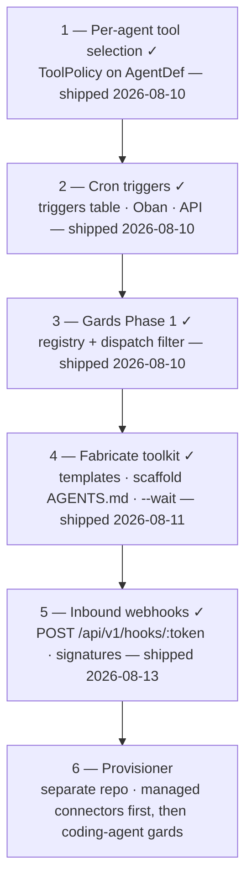

# Norns Roadmap

**Status:** v3
**Last updated:** 2026-08-10

Sequencing for the next phase of work. For what's already built and why, see
`decision-log.md`. For the product direction this sequence serves, see
`plan-agent-builder.md`. This doc is about what comes next and in what order.

---

## Where we are

The core is shipping: durable agent process, orchestrator/worker split,
provider-neutral LLM format, conversations, REST API + dashboard, multi-agent
orchestration, and both SDKs published (Python on PyPI, Elixir on Hex as of
v0.1.0).

The v1 roadmap's "Now" tier is **done**: subagent allowlists shipped
(`SubagentPolicy`), human-in-the-loop is fully wired (`ask_human` /
`:waiting` / `POST /runs/:id/reply`), and sub-agent crash recovery is fixed —
a resumed parent reattaches to its in-flight child instead of relaunching it
(reattach-by-run-id, subscribe-before-read; see `architecture.md`).

## Where we're going

**The agent builder** (`plan-agent-builder.md`): prompt → running, durable
agent. Its central split — **compose** (assemble existing tenant tools into a
new def, pure data, no deploy) vs **fabricate** (generate missing worker code
from a template) — drives the sequence below. Compose is the default mode;
every step here is independently useful even if the builder never ships.

**The v1 fork is decided: own the provisioner.** Fabricated workers need
somewhere durable to run, and that is the provisioner/managed-gards branch.
The coding-agent thread and the builder thread are the same thread. The
durability branch (Durable MCP → custom workflows) stays parked, not dead —
`plan-durable-mcp.md` remains Phase 0 for `plan-custom-agent-workflows.md`
whenever it's picked up.

**The cloud boundary is decided (2026-08-10,** `decision-log.md` **§ The
cloud boundary).** Core (OSS) ships the runtime and the primitives below —
each independently useful, none builder-only. Cloud ships the builder (an
agent running on Norns; it can't live in core without breaking orchestrator
purity), the provisioner, managed gards, and managed connectors. The
provisioner's **first product is managed connectors** — no snapshots, no
tunnels, no code extraction, just supervised containers with injected
secrets — which de-risks the provisioner and hosts the capability layer the
builder later composes against.

---

## The sequence

### 1. Per-agent tool selection — done (2026-08-10)

Shipped as `Norns.Agents.ToolPolicy`: a per-agent allowlist of worker tools
in `model_config["tools"]`, same shape and defaults philosophy as
`SubagentPolicy`. Filters the advertised tool list and rejects out-of-policy
calls at dispatch with a `tool_call_denied` audit event; built-ins exempt.
See `decision-log.md` § Implemented.

### 2. Cron triggers — done (2026-08-10)

Shipped: `triggers` table (agent, cron expression, message, optional
persistent `conversation_key`), fired by a minutely Oban job with an atomic
per-minute claim so a trigger fires at most once per matching minute. Full
CRUD at `/api/v1/triggers` plus `POST /triggers/:id/fire` for testing a
trigger outside its schedule. Runs carry `trigger_type: "schedule"`. Norns is
the system of record — composed agents have no repo for config to live in.
`nornsctl triggers` (list/show/create/update/enable/disable/delete/fire)
shipped in the nornsctl repo the same day.

### 3. Gards Phase 1 — done (2026-08-10)

Registry + dispatch filter, per `gards.md`: `gards`/`gard_ports` tables,
atomic claim tokens, strict-equality dispatch (no-gard runs never touch gard
workers and vice versa), gard-filtered tool advertisement, gard-aware
TaskQueue flush, per-run binding with child inheritance and resume-safe
affinity, gard-scoped idempotency keys, REST CRUD + worker-channel port
registration. The full surface shipped with it: `nornsctl gards`
(create/list/inspect/ports/destroy), the `/gards` dashboard page, and Python
SDK support (`norns.run(agent, gard=, claim_token=)` + `register_port`) —
verified end to end against a live worker. Secrets injection stays a named
provisioner (Phase 2) requirement.

### 4. Fabricate toolkit — done (2026-08-11)

Shipped in the nornsctl repo:

- `nornsctl new --template <name>` — `default` and `slack-bot` (outbound
  `post_to_slack` / `list_slack_channels`; the bot token never leaves the
  worker). The builder writes one tool function, not a system.
- Every scaffold ships `AGENTS.md` teaching any coding agent the full
  build/test/debug loop (scaffold → worker up → test message → read run
  events → iterate). This is the v0 builder.
- `nornsctl agents message --wait` — blocks until the run completes (prints
  output), fails (prints the failure inspector), or parks on a question
  (prints it with the reply command). Verified live.
- Templates ship a Dockerfile + deploy notes as the interim hosting story.

Still open from the template family: a `slack-connector` variant (Socket
Mode inbound listener) — the scaffold's `AGENTS.md` documents the pattern;
build it with the first connector-hosting work.

### 5. Inbound webhooks — done (2026-08-13)

Shipped: `POST /api/v1/hooks/:token` starts a run on the mapped agent with
`trigger_type: "webhook"`. Per-hook server-generated tokens; provider
signature verification (`github`, `stripe`, `slack` — HMAC over the raw
body, constant-time compare, replay-bounded timestamps); optional
`message_path` (e.g. Twilio's `Body`) and `conversation_key_path` (e.g.
`From`, so each sender keeps its own history — verified by test). Unknown
and disabled tokens are indistinguishable; a busy conversation returns 409
so providers retry. Management CRUD at `/api/v1/hooks` + `nornsctl hooks`.
Twilio/Mailgun/GitHub/Stripe are now configuration instead of code.

### 6. Provisioner (separate repo)

Phases 2+ of `gards.md`, **connector workload first**: supervised containers
running prebuilt connector images with injected secrets — the managed-
connector product, and the provisioner's minimum viable form. Then the
coding-agent additions (code extraction, tunnels), then snapshots and
Firecracker. This is the "own the provisioner" commitment — managed gards as
the home for the tenant's capability layer and, later, builder output.

---

## Alongside, when convenient

- **Slack connector template/example.** The most demo-able thing Norns could
  have: conversations keyed by thread, `ask_human` relayed into the channel,
  durability visible in a channel people actually use. The outbound half
  shipped as the `slack-bot` template (step 4); the inbound Socket Mode
  listener remains.
- **Blog post** — sub-agent recovery write-up: published as
  ["Is This Still Happening?"](https://mackeracher.com/posts/is-this-still-happening/)
  (2026-08-08).
- **Cross-SDK parity gaps** — Python serial task handling (a real concurrency
  bug under load), per-request LLM keys, model-string separator, graceful
  shutdown. Small and independently shippable — and the first two stop being
  optional once connectors run 24/7 in managed gards (see Cloud readiness).
- **Skírnir** (`skirnir-v0.1-spec.md`) — its runtime blocker (HITL wiring) is
  gone; build whenever the Elixir flagship demo is wanted.

---

## Cloud readiness

Not sequenced above because none blocks the primitives — but each becomes
real the moment there is a hosted product, and the core API must not paint
itself into a corner on any of them (`decision-log.md` § Cloud readiness):

- **API key scoping** — one bearer token is full tenant power today; a hosted
  builder holding one is the trust problem the introspection toolkit was
  pruned for. Scoped keys are the pre-cloud form of the capability model.
- **Tenant self-serve** — signup → tenant → key issuance. Cloud-repo work.
- **Retention plan** — cron-triggered agents generate events unboundedly;
  needed before cloud launch, not before growth forces it.
- **SDK hardening** — serial task handling and graceful shutdown, for
  connectors that run 24/7.

---

## Not now

Carried forward, deliberately unscheduled:

- **Durable MCP + custom workflows** — parked by the fork decision above.
- **A Norns MCP server** — redundant for CLI clients, insufficient for GUI
  clients; see `plan-agent-builder.md` § Not building.
- **Agent-write tools for agents** (`create_agent` as a tool) — not until a
  capability model exists.
- **Eval primitive / diff_runs / fixture runner** — after the builder loop
  proves itself.
- **Multi-node / Horde clustering.** Registry + DynamicSupervisor are
  single-node (`decision-log.md`).
- **Generic policy-enforcement hook.** Pre-dispatch hook point; architecture
  supports it, not built. Note: `SubagentPolicy` and tool selection are both
  bespoke policy checks — a third one is the signal to build the generic hook.
- **Retention, cleanup, partitioning.** Priority #4 in
  `lessons-absurd-production.md`. Promoted to a cloud-launch prerequisite —
  see Cloud readiness above.
- **Two-phase step API.** Prototype only if a concrete workflow needs it.
- **Fan-out / descendant budget.** `max_depth` bounds recursion, not cost; a
  real spend ceiling is a different mechanism.

---

## Caveat: in-process is a self-host story

The Elixir SDK's sharpest technical claim is the in-process worker — tools
running in the same BEAM VM as the orchestrator, no serialization boundary.
That is what Skírnir exists to demonstrate.

**Managed gards do not deliver it.** A gard is a container or VM; a worker
inside one is co-located, but there is still a serialization boundary. The
in-process advantage is structurally a self-host/embedded property, and the
only hosted form that delivers it is single-tenant dedicated (BEAM process
isolation is a fault boundary, not a security boundary). Marketing should not
promise in-process behaviour that the multi-tenant product cannot deliver.

---

## Related docs

- `decision-log.md` — what's built and why
- `plan-agent-builder.md` — product direction: compose/fabricate, triggers, pruned alternatives
- `gards.md` — worker affinity design (Draft v6, connector-first provisioner)
- `plan-subagent-allowlists.md` — agent authorization (Phase 1 shipped)
- `plan-durable-mcp.md` — durable step protocol (parked)
- `plan-custom-agent-workflows.md` — `@agent` + `ctx.*` durable primitives (parked)
- `skirnir-v0.1-spec.md` — Elixir flagship demo
- `lessons-absurd-production.md` — operational priorities
