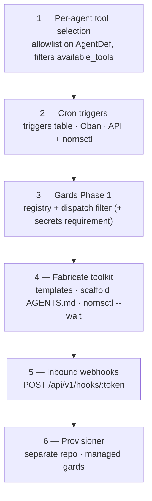

# Norns Roadmap

**Status:** v2
**Last updated:** 2026-08-08

Sequencing for the next phase of work. For what's already built and why, see
`decision-log.md`. For the product direction this sequence serves, see
`plan-agent-builder.md`. This doc is about what comes next and in what order.

---

## Where we are

The core is shipping: durable agent process, orchestrator/worker split,
provider-neutral LLM format, conversations, REST API + dashboard, multi-agent
orchestration, and both SDKs published (Python on PyPI, Elixir on Hex as of
v0.1.0).

The v1 roadmap's "Now" tier is **done**: subagent allowlists shipped
(`SubagentPolicy`), human-in-the-loop is fully wired (`ask_human` /
`:waiting` / `POST /runs/:id/reply`), and sub-agent crash recovery is fixed —
a resumed parent reattaches to its in-flight child instead of relaunching it
(reattach-by-run-id, subscribe-before-read; see `architecture.md`).

## Where we're going

**The agent builder** (`plan-agent-builder.md`): prompt → running, durable
agent. Its central split — **compose** (assemble existing tenant tools into a
new def, pure data, no deploy) vs **fabricate** (generate missing worker code
from a template) — drives the sequence below. Compose is the default mode;
every step here is independently useful even if the builder never ships.

**The v1 fork is decided: own the provisioner.** Fabricated workers need
somewhere durable to run, and that is the provisioner/managed-gards branch.
The coding-agent thread and the builder thread are the same thread. The
durability branch (Durable MCP → custom workflows) stays parked, not dead —
`plan-durable-mcp.md` remains Phase 0 for `plan-custom-agent-workflows.md`
whenever it's picked up.

---

## The sequence

### 1. Per-agent tool selection

Today every agent sees every tool in the tenant (`process.ex:233` — builtins +
def tools + all worker tools, unfiltered). Composing agents from a shared
capability layer is impossible without scoping, and it's a safety gap
regardless. Add a tool allowlist to `AgentDef`, same shape and defaults
philosophy as `SubagentPolicy`. Small, prerequisite for everything below.

### 2. Cron triggers

`triggers` table (agent, cron expression, message template), fired by Oban
(already a dependency), managed via API + `nornsctl triggers`. Norns is the
system of record — composed agents have no repo for config to live in. Runs
gain `trigger_type: "schedule"`.

### 3. Gards Phase 1

Registry + dispatch filter, per `gards.md` — unchanged scope, two additions
from the builder work: secrets injection (env into the gard) is a named
provisioner requirement, and the provisioner is on the critical path rather
than optional.

### 4. Fabricate toolkit

- `nornsctl new --template <name>` — templates as generation targets
  (`slack-bot`, `slack-connector`, …). The builder writes one tool function,
  not a system.
- Scaffold ships `AGENTS.md` teaching any coding agent the build/test/debug
  loop. This is the v0 builder.
- `nornsctl agents message --wait` — the missing loop primitive (SDK already
  has `wait=True`).
- Templates ship a Dockerfile + deploy README as the interim hosting story.

### 5. Inbound webhooks

`POST /api/v1/hooks/:hook_token` → run on the mapped agent, with optional
conversation-key extraction from the payload. Pure ingress, per-hook token
auth. Makes Twilio/Mailgun/GitHub/Stripe integration configuration instead of
code.

### 6. Provisioner (separate repo)

Phases 2+ of `gards.md`: Docker provisioner, code extraction, tunnels, then
snapshots and Firecracker. This is the "own the provisioner" commitment —
managed gards as the home for builder output.

---

## Alongside, when convenient

- **Slack connector template/example.** The most demo-able thing Norns could
  have: conversations keyed by thread, `ask_human` relayed into the channel,
  durability visible in a channel people actually use. Falls out of step 4.
- **Blog post** — sub-agent recovery write-up (seed drafted).
- **Cross-SDK parity gaps** — Python serial task handling (a real concurrency
  bug under load), per-request LLM keys, model-string separator, graceful
  shutdown. Small and independently shippable.
- **Skírnir** (`skirnir-v0.1-spec.md`) — its runtime blocker (HITL wiring) is
  gone; build whenever the Elixir flagship demo is wanted.

---

## Not now

Carried forward, deliberately unscheduled:

- **Durable MCP + custom workflows** — parked by the fork decision above.
- **A Norns MCP server** — redundant for CLI clients, insufficient for GUI
  clients; see `plan-agent-builder.md` § Not building.
- **Agent-write tools for agents** (`create_agent` as a tool) — not until a
  capability model exists.
- **Eval primitive / diff_runs / fixture runner** — after the builder loop
  proves itself.
- **Multi-node / Horde clustering.** Registry + DynamicSupervisor are
  single-node (`decision-log.md`).
- **Generic policy-enforcement hook.** Pre-dispatch hook point; architecture
  supports it, not built. Note: `SubagentPolicy` and tool selection are both
  bespoke policy checks — a third one is the signal to build the generic hook.
- **Retention, cleanup, partitioning.** Priority #4 in
  `lessons-absurd-production.md`. Plan before growth forces it.
- **Two-phase step API.** Prototype only if a concrete workflow needs it.
- **Fan-out / descendant budget.** `max_depth` bounds recursion, not cost; a
  real spend ceiling is a different mechanism.

---

## Caveat: in-process is a self-host story

The Elixir SDK's sharpest technical claim is the in-process worker — tools
running in the same BEAM VM as the orchestrator, no serialization boundary.
That is what Skírnir exists to demonstrate.

**Managed gards do not deliver it.** A gard is a container or VM; a worker
inside one is co-located, but there is still a serialization boundary. The
in-process advantage is structurally a self-host/embedded property, and the
only hosted form that delivers it is single-tenant dedicated (BEAM process
isolation is a fault boundary, not a security boundary). Marketing should not
promise in-process behaviour that the multi-tenant product cannot deliver.

---

## Related docs

- `decision-log.md` — what's built and why
- `plan-agent-builder.md` — product direction: compose/fabricate, triggers, pruned alternatives
- `gards.md` — worker affinity design (Draft v4)
- `plan-subagent-allowlists.md` — agent authorization (Phase 1 shipped)
- `plan-durable-mcp.md` — durable step protocol (parked)
- `plan-custom-agent-workflows.md` — `@agent` + `ctx.*` durable primitives (parked)
- `skirnir-v0.1-spec.md` — Elixir flagship demo
- `lessons-absurd-production.md` — operational priorities
