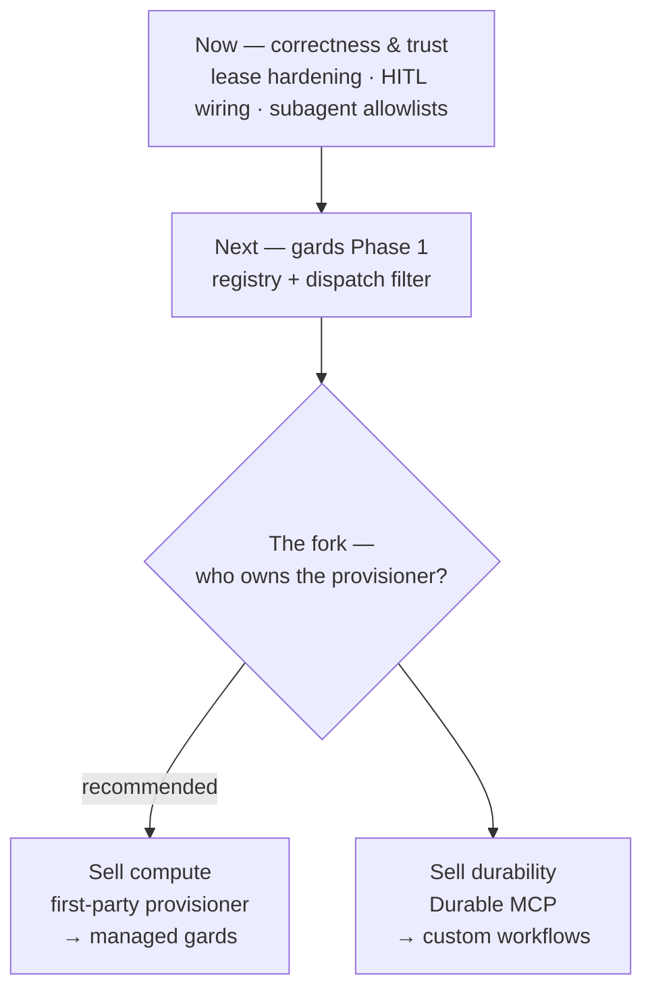

# Norns Roadmap

**Status:** Draft (v1)
**Last updated:** 2026-08-03

Sequencing for the next phase of work, and the one strategic decision that
shapes everything after it. For what's already built and why, see
`decision-log.md`. This doc is about what comes next and in what order.

---

## Where we are

The core is shipping: durable agent process, orchestrator/worker split,
provider-neutral LLM format, conversations, REST API + dashboard, multi-agent
orchestration, and both SDKs published (Python on PyPI, Elixir on Hex as of
v0.1.0). Recent work has been reliability polish rather than new surface —
reclaiming in-flight tasks on worker crash/reconnect, and removing the
orchestrator-side LLM execution path to enforce the pure-orchestrator
invariant.

---

## The sequence

### Now — correctness and trust

Small, compounding, no decisions required. Everything else sits on top of
these.

1. **Claim/lease/race hardening.** Already in flight. Expand conformance and
   failure-window tests. Priority #2 in `lessons-absurd-production.md`.
2. **Wire `waiting_for_user` into `process.ex`.** The event exists in the
   runtime contract but the `:waiting` state isn't wired into the agent state
   machine. This is usually filed as a Skírnir blocker; it isn't. *Any* agent
   that confirms before a side effect needs it — see the Skírnir system prompt,
   which mandates exactly that behaviour (`skirnir-v0.1-spec.md`). Treat it as
   a runtime gap that happens to block the demo.
3. **Subagent allowlists.** Scoped, non-breaking, motivated by a real incident
   where `mimir-dev` could enumerate and launch other agents in the tenant.
   See `plan-subagent-allowlists.md`.

### Next — gards Phase 1

Build the gard registry and the dispatch filter, and nothing else. Per
`gards.md`, the Norns-side changes are small and well-contained: a new table,
a filter in `WorkerRegistry.find_worker`, port URL registration, a LiveView
page.

This unblocks coding agents — the use case that structurally requires worker
affinity — and it commits us to nothing. The provisioner is a separate tool by
design, so Phase 1 can land while the question below stays open.

### The fork — who owns the provisioner?

`gards.md` deliberately puts infrastructure outside Norns:

> "Norns does NOT create, manage, or provision gards. A separate **worker
> provisioner** (external tool) handles infrastructure… This keeps Norns as a
> pure orchestrator."

That boundary is drawn at the **repo** level, not the **company** level. The
orchestrator can stay pure — never creating a container, never executing
anything — while nornscode ships a first-party provisioner as a separate
product running on Norns Cloud. `gards.md` Case 2 (remote/sandboxed) already
describes that flow end to end: templates, containers, claim tokens, tunnels,
code extraction.

So the decision is not "should the orchestrator host code" (answered: no). It
is **whether we ship and operate the provisioner as a commercial product.**

|                   | Own the provisioner                        | Don't                                   |
| ----------------- | ------------------------------------------ | --------------------------------------- |
| What we sell      | Compute — managed gards                    | Durability — orchestration semantics     |
| Next big build    | Provisioner → snapshots → Firecracker      | Durable MCP → custom `@agent` workflows  |
| Who it's for      | Coding agents; teams who won't run infra   | Teams already sold on durable execution  |
| Risk              | We own an infra + isolation surface        | Large unproven semantics work            |
| Trust story       | Runtime stays pure; cloud tier is opt-in   | Unchanged                                |

**Recommendation: own it.** Shorter path to something people pay for, coding
agents are the clear and current use case, and it's where the design work has
already gone — `gards.md` is v4 and the most detailed doc in this directory,
while the Durable MCP and custom-workflow plans haven't moved since April.

The counter-case is real and worth stating: the durability path is fully
compatible with the pure-orchestrator identity forever and needs no new trust
bargain. But it is the larger risk. Deterministic replay, determinism
enforcement, and event-log growth are all unresolved in that plan's own open
questions, and it is the kind of semantics work that half-lands. Gards Phase 1
is a couple of weeks against a 14-step spec.

If we take the provisioner path, the durability chain doesn't die — it
deprioritises. `plan-durable-mcp.md` remains Phase 0 for
`plan-custom-agent-workflows.md` whenever it's picked up.

---

## Caveat: in-process is a self-host story

The Elixir SDK's sharpest technical claim is the in-process worker — tools
running in the same BEAM VM as the orchestrator, no serialization boundary.
That is what Skírnir exists to demonstrate (`skirnir-v0.1-spec.md`).

**Managed gards do not deliver it.** A gard is a container or VM; a worker
inside one is co-located — same region, low latency — but there is still a
serialization boundary. The in-process advantage is structurally a
self-host/embedded property.

The only hosted form that delivers it is **single-tenant dedicated**: one
customer's orchestrator and worker code in one VM. That also sidesteps the
isolation problem entirely, because BEAM process isolation is a fault boundary,
not a security boundary — fine with one tenant, unusable with many.

Practical consequence: our best technical story and our most scalable
monetisation story point at different customers. Marketing should not promise
in-process behaviour that the multi-tenant product cannot deliver.

---

## Not now

Carried forward, deliberately unscheduled:

- **Multi-node / Horde clustering.** Registry + DynamicSupervisor are
  single-node (`decision-log.md`).
- **Generic policy-enforcement hook.** Pre-dispatch hook point; architecture
  supports it, not built.
- **Retention, cleanup, partitioning.** Priority #4 in
  `lessons-absurd-production.md`. Plan before growth forces it.
- **Two-phase step API.** Prototype only if a concrete workflow needs it.
- **Gard snapshots and Firecracker.** Phases 3–4 of `gards.md`; downstream of
  the fork above.
- **Cross-SDK parity gaps.** Python's serial task handling (a genuine
  concurrency bug under load), per-request LLM keys, model-string separator
  mismatch, graceful worker shutdown. Small and independently shippable.

---

## Related docs

- `decision-log.md` — what's built and why
- `gards.md` — worker affinity design (Draft v4)
- `plan-durable-mcp.md` — durable step protocol; Phase 0 for the below
- `plan-custom-agent-workflows.md` — `@agent` + `ctx.*` durable primitives
- `plan-subagent-allowlists.md` — agent authorization
- `skirnir-v0.1-spec.md` — Elixir flagship demo
- `lessons-absurd-production.md` — operational priorities
