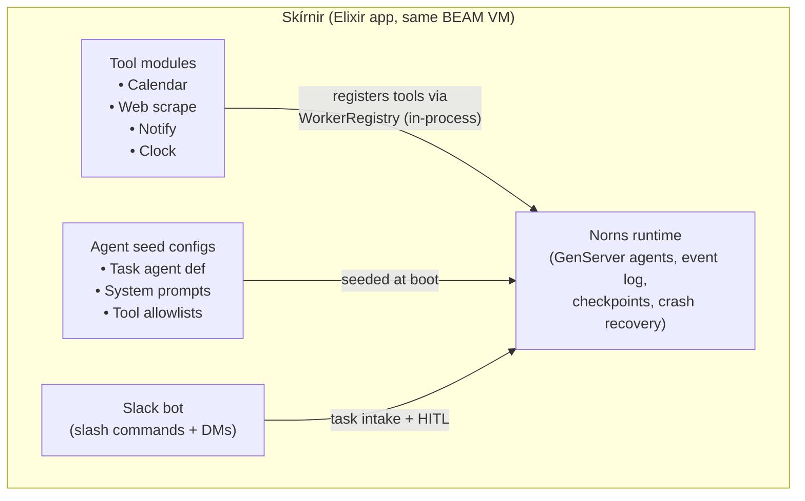

# Skírnir v0.1 — Build Spec

**Personal automation agent runtime on Norns.**

One sentence from a human. Thirty minutes of real work across real systems. Durable, resumable, observable.

## What This Is

Skírnir is an Elixir application that runs on top of Norns. It provides:

1. A set of **tool modules** (Google Calendar, web scraping, notifications, Slack intake) that connect to Norns as an in-process worker
2. A small set of **pre-configured agent definitions** optimized for personal automation tasks
3. A **Slack bot interface** for task intake ("buy me concert tickets for...") and HITL responses
4. A **demo script** that exercises Norns' durability, crash recovery, and concurrent agent execution in ways that are impossible on other runtimes

Skírnir is a reference implementation. Its purpose is a launch writeup demonstrating Norns. The tool integrations are real but narrow. The agent logic is prompt-driven, not code-driven.

## Architecture



### Why in-process, not a separate worker?

Mimir (Python SDK) connects to Norns over WebSocket. That's the polyglot story. Skírnir demonstrates the Elixir-native story: tools run in the same BEAM VM as the Norns orchestrator. No serialization boundary. The tool modules are plain Elixir functions registered directly with WorkerRegistry. This is the architectural advantage the Elixir SDK has over every other runtime's SDK.

### How it plugs into Norns

Skírnir does NOT fork or modify the Norns orchestrator. It uses the existing public interfaces:

- **Tool registration:** Calls `WorkerRegistry.register_worker/5` at boot with an in-process "worker" that dispatches tool calls to local Elixir functions. No WebSocket needed.
- **Agent definitions:** Seeds agent records via `Norns.Agents.create_agent/1` at boot (idempotent).
- **Task intake:** Slack bot hits `POST /api/v1/agents/:id/messages` to start runs.
- **HITL:** Agent enters `:waiting` state; Slack bot receives the prompt via PubSub, DMs the user, relays the response.
- **Observability:** The existing Norns LiveView dashboard shows all Skírnir agents, runs, and events. No custom UI needed for v0.1.

## Agent Design

### Single agent type: the Task Agent

v0.1 has one agent type. It receives a natural-language task, decomposes it into steps, executes them using tools, and asks the human when it's stuck or needs a decision.

The agent is **conversation-mode** (persistent history per Slack user) so it can handle follow-ups: "actually make it Saturday instead."

**System prompt (abbreviated):**

```
You are a personal automation agent. The user gives you tasks in plain language.
You have real tools that take real actions — calendar events, web lookups,
notifications. Use them.

Rules:
- Before taking any action with real side effects, confirm with the user
  using the ask_human tool. State what you're about to do and why.
- If you're unsure about any detail, ask. Don't guess.
- If a tool fails, explain what happened and offer alternatives.
- For time-sensitive tasks (monitoring, scheduled reminders), use the wait
  tool to sleep and check again later.
- Keep responses concise. The user is on Slack, not reading essays.
```

**Model:** `claude-sonnet-4-20250514`
**Max steps:** 30
**Checkpoint policy:** `every_step` (durability demo — we want fine-grained resume)
**On failure:** `retry_last_step`

### No sub-agents in v0.1

Each task is one agent, one run. The `launch_agent` builtin exists in Norns but Skírnir doesn't use it yet. Sub-agent orchestration is v0.2 (see Out of Scope).

## Tools

Six tools. All real. All have side effects marked for idempotency.

### 1. `web_search`
- **What:** Search the web via Tavily API. Returns top results with snippets and URLs.
- **Input:** `{ query: string, max_results?: int }`
- **Output:** JSON array of `{ title, url, snippet }`
- **Side effect:** No
- **Why:** Needed for research sub-tasks (concert dates, product prices, recipe lookup).

### 2. `web_scrape`
- **What:** Fetch and extract text content from a URL. Uses Req + Floki for HTML parsing.
- **Input:** `{ url: string, selector?: string }`
- **Output:** Extracted text content (truncated to 4KB)
- **Side effect:** No
- **Why:** Needed to read specific pages (event listings, product pages, recipe details).

### 3. `calendar_read`
- **What:** Read upcoming events from Google Calendar within a date range.
- **Input:** `{ start_date: string, end_date: string, calendar_id?: string }`
- **Output:** JSON array of events `{ summary, start, end, location }`
- **Side effect:** No
- **Why:** Agent needs to check conflicts before scheduling.

### 4. `calendar_create`
- **What:** Create a Google Calendar event.
- **Input:** `{ summary: string, start: datetime, end: datetime, description?: string, location?: string }`
- **Output:** `{ event_id, link }`
- **Side effect:** Yes. Idempotency key = `run_id + step + tool_call_id`.
- **Why:** The "schedule it in my calendar" part of tasks.

### 5. `notify`
- **What:** Send a notification to the user. v0.1: Slack DM only.
- **Input:** `{ message: string, urgency?: "low" | "normal" | "high" }`
- **Output:** `{ delivered: true }`
- **Side effect:** Yes (but idempotent — duplicate notifications are acceptable).
- **Why:** Scheduled reminders ("at 4:30pm remind me..."), task completion alerts, monitoring results.

### 6. `ask_human`
- **What:** Pause execution and ask the user a question. The agent enters `:waiting` state. The Slack bot DMs the user and relays their response.
- **Input:** `{ question: string, options?: [string] }`
- **Output:** `{ response: string }` (the human's reply)
- **Side effect:** No (it's a blocking call, not a mutation).
- **Why:** HITL is a first-class Norns feature. This tool exercises the `:waiting` state and demonstrates that a durable agent can sleep for hours waiting for a human and resume exactly where it left off.

### Built-in tools inherited from Norns
- `wait` — sleep for N seconds. Used for monitoring loops and scheduled triggers.
- `list_agents` / `launch_agent` — available but not used in v0.1 prompts.

## Slack Integration

### Intake

- **Slash command:** `/skirnir buy tickets for Alvvays at the Danforth when they go on sale`
- **DM:** User DMs the Skírnir bot directly with a task.

Both create a new run via `POST /api/v1/agents/:id/messages` with `conversation_key` = Slack user ID. This means each user gets persistent conversation history.

### HITL Flow

1. Agent calls `ask_human` tool → enters `:waiting` state
2. Skírnir's PubSub listener receives the event
3. Slack bot DMs the user: "I found tickets for Friday June 20 ($45) and Saturday June 21 ($55). Which one?"
4. User replies in Slack
5. Skírnir relays the response → agent resumes from `:waiting`

### Status Updates

Agent PubSub events (`tool_call`, `tool_result`, `llm_response`, `completed`, `error`) are forwarded to the Slack thread as brief status updates. The user sees the agent working in real time.

## In-Process Worker Implementation

The key Skírnir architectural piece: an in-process Norns worker that doesn't use WebSocket.

```elixir
defmodule Skirnir.Worker do
  @moduledoc """
  In-process Norns worker. Registers tools directly with
  WorkerRegistry using self() as the channel_pid, then
  handles tool_task messages by calling local Elixir functions.
  """

  use GenServer

  def start_link(opts) do
    GenServer.start_link(__MODULE__, opts, name: __MODULE__)
  end

  def init(opts) do
    tenant_id = Keyword.fetch!(opts, :tenant_id)

    tools = [
      Skirnir.Tools.WebSearch.definition(),
      Skirnir.Tools.WebScrape.definition(),
      Skirnir.Tools.CalendarRead.definition(),
      Skirnir.Tools.CalendarCreate.definition(),
      Skirnir.Tools.Notify.definition(),
      Skirnir.Tools.AskHuman.definition(),
    ]

    Norns.Workers.WorkerRegistry.register_worker(
      tenant_id, "skirnir", self(), tools,
      capabilities: [:llm, :tools]
    )

    {:ok, %{tenant_id: tenant_id}}
  end

  # Handle tool dispatch from Norns orchestrator
  def handle_info({:push_tool_task, task}, state) do
    result = Skirnir.Tools.execute(task.tool_name, task.input)
    Norns.Workers.WorkerRegistry.deliver_result(task.task_id, result)
    {:noreply, state}
  end

  # Handle LLM dispatch — call Anthropic directly in-process
  def handle_info({:llm_task, task}, state) do
    result = Skirnir.LLM.call(task)
    Norns.Workers.WorkerRegistry.deliver_result(task.task_id, result)
    {:noreply, state}
  end
end
```

This is the in-process Elixir SDK story in ~30 lines. The tool functions are normal Elixir. No serialization, no WebSocket, no network hop.

## Data Model

Skírnir adds NO tables to the Norns database. It uses:

- `agents` — one seeded record: the Skírnir task agent
- `conversations` — one per Slack user (keyed by Slack user ID)
- `runs` — one per task
- `run_events` — standard Norns event log

Configuration (API keys, Slack tokens) lives in environment variables, not the database.

## Configuration

All via environment variables:

| Variable | Required | Description |
|----------|----------|-------------|
| `TAVILY_API_KEY` | Yes | Web search API key |
| `GOOGLE_CALENDAR_CREDENTIALS` | Yes | Google OAuth2 service account JSON (base64) |
| `GOOGLE_CALENDAR_ID` | Yes | Calendar ID to read/write |
| `SLACK_BOT_TOKEN` | Yes | Slack bot OAuth token |
| `SLACK_APP_TOKEN` | Yes | Slack app-level token (Socket Mode) |
| `SLACK_SIGNING_SECRET` | Yes | Slash command verification |
| `ANTHROPIC_API_KEY` | Yes | LLM calls (in-process worker) |

## Demo Script (Primary Deliverable)

The launch writeup walks through these five beats. Each beat demonstrates a Norns runtime property that other runtimes can't match.

### Beat 1: Task intake and real execution
> "Hey Skírnir, find me tickets for Alvvays at the Danforth Music Hall and put it in my calendar."

Agent searches for the concert → finds dates and prices → calls `ask_human` ("Friday $45 or Saturday $55?") → user replies "Friday" → agent creates calendar event → confirms in Slack.

**Shows:** Real tools doing real work. Side effects. HITL as a natural pause point.

### Beat 2: Scheduled monitoring with sleep
> "Let me know when the new Elixir 1.18 release drops."

Agent searches for current version → determines it hasn't released → calls `wait(86400)` (sleep 24 hours) → wakes up → searches again → repeats until found → notifies user.

**Shows:** Long-running durable agent. The wait builtin. An agent that lives for days.

### Beat 3: Kill the runtime, everything resumes
While beat 2's agent is sleeping and beat 1 is mid-execution:
```bash
kill -9 <beam_pid>
# restart
mix phx.server
```
Both agents resume from their last checkpoint. The sleeping agent continues its countdown. The mid-task agent re-executes from the last completed step.

**Shows:** Durability. Crash recovery. This is the money shot for the writeup.

### Beat 4: Concurrent agents, negligible overhead
Show Observer with 10+ active Skírnir agents (various tasks for demo purposes). Total memory: ~50MB for the entire BEAM VM. Each agent is a single GenServer process.

**Shows:** BEAM concurrency model. Cheap processes. "50 personal agents on a $5 VPS."

### Beat 5: Live observability
Show the Norns LiveView dashboard while an agent is working. Event log streaming in real time. Click into a run, see every LLM call, every tool invocation, every checkpoint. Click into a failed run, see the failure inspector.

**Shows:** The observability story. Event sourcing. The dashboard that comes free with Norns.

## Project Structure

```
skirnir/
├── lib/
│   ├── skirnir/
│   │   ├── application.ex       — OTP app, starts worker + Slack bot
│   │   ├── worker.ex            — In-process Norns worker (above)
│   │   ├── llm.ex               — Anthropic API client (in-process)
│   │   ├── seed.ex              — Idempotent agent definition seeding
│   │   ├── slack/
│   │   │   ├── bot.ex           — Socket Mode connection + event routing
│   │   │   ├── commands.ex      — Slash command handler
│   │   │   └── responder.ex     — PubSub listener → Slack message formatter
│   │   └── tools/
│   │       ├── web_search.ex    — Tavily wrapper
│   │       ├── web_scrape.ex    — Req + Floki
│   │       ├── calendar_read.ex — Google Calendar API (read)
│   │       ├── calendar_create.ex — Google Calendar API (write)
│   │       ├── notify.ex        — Slack DM notification
│   │       └── ask_human.ex     — HITL pause + Slack prompt
│   └── skirnir.ex               — Public API
├── test/
│   ├── skirnir/
│   │   ├── worker_test.exs
│   │   └── tools/
│   │       ├── web_search_test.exs
│   │       ├── calendar_test.exs
│   │       └── ...
│   └── test_helper.exs
├── config/
│   ├── config.exs
│   ├── dev.exs
│   ├── test.exs
│   └── runtime.exs              — env var loading
├── mix.exs
└── README.md
```

Skírnir is a **separate Mix project** that depends on Norns as a path dependency (or, later, a Hex package). It is NOT inside the Norns repo.

## Acceptance Criteria

### Must have for launch writeup
- [ ] In-process worker registers tools and handles LLM dispatch without WebSocket
- [ ] Agent receives a task via Slack, executes multi-step plan using real tools
- [ ] `ask_human` pauses agent, prompts user in Slack, resumes on reply
- [ ] `wait` tool sleeps agent for configurable duration, agent resumes correctly
- [ ] Kill BEAM mid-run → restart → agent resumes from last checkpoint (proven by demo)
- [ ] 3+ concurrent agents visible in Norns dashboard
- [ ] Google Calendar event actually created (real API, real calendar)
- [ ] Web search returns real results (real Tavily API)
- [ ] All tool calls logged as Norns events, visible in event timeline
- [ ] Failure inspector shows meaningful error for a deliberately-failed run

### Must have for code quality
- [ ] All tools have unit tests with mocked external APIs
- [ ] In-process worker registration tested against real WorkerRegistry
- [ ] Resume-from-checkpoint tested (process dies, new process replays and continues)
- [ ] `ask_human` HITL flow tested end-to-end with mock Slack

### Nice to have (do if time allows)
- [ ] Slack thread-based status updates (agent progress visible in thread)
- [ ] Multiple calendar support
- [ ] Cost tracking per run (input/output tokens displayed in dashboard)

## Out of Scope (v0.1)

These are explicitly cut. Some are good ideas for later. None are needed for the launch writeup.

- **Sub-agent orchestration.** No `launch_agent` usage. Each task is a single agent. The supervised hierarchy demo is a different writeup.
- **Multi-tenant.** One tenant, one user (you). Multi-tenant Skírnir is a managed-cloud concern.
- **Custom UI.** The Norns LiveView dashboard is the UI. No Skírnir-specific frontend.
- **Purchasing / payment.** "Buy tickets" means "find tickets and create a calendar hold." No actual payment processing. The demo narrates this as a deliberate HITL checkpoint: the agent finds the tickets and links you to the purchase page.
- **Email integration.** Slack only for v0.1.
- **Voice / SMS.** Slack only.
- **Persistent agent memory across conversations.** Conversation history is per-user via Norns conversations. No cross-conversation memory, no vector store, no RAG.
- **Agent self-improvement.** No feedback loops, no fine-tuning, no prompt optimization.
- **Rate limiting / abuse prevention.** Single user, personal deployment.
- **Mobile app.** Slack is the mobile client.
- **Webhooks / inbound triggers.** All tasks start from Slack. No cron, no webhook listeners, no event-driven triggers. The `wait` tool handles time-based patterns.
- **Tool authentication UI.** API keys are env vars. No OAuth flow in the app.
- **Hot code reload demo.** Originally planned as a demo beat. Cut from v0.1 — it requires OTP release tooling that adds scope. Can be a standalone blog post later.
- **10k agent scale demo.** Different narrative. Separate blog post if ever.
- **Elixir SDK packaging.** The in-process worker pattern is demonstrated by Skírnir's code. Extracting it into a reusable SDK package is separate work.

## Open Questions (Resolve Before Building)

1. **In-process worker registration.** The current `WorkerRegistry` expects `channel_pid` to be a Phoenix Channel process (it pushes messages via `send/2`). The in-process worker approach should work since it's just `send(pid, {:push_tool_task, task})`, but need to verify there's no Channel-specific assumption in the message handling path.

2. **`ask_human` implementation.** The Norns runtime has `:waiting` as a defined state but the current Process module doesn't have a built-in mechanism for pausing and resuming on human input. Need to determine: does `ask_human` use the existing `wait`-like mechanism, or does it need a new event type (`waiting_for_user` exists in the event contract but isn't wired into Process yet)?

3. **Slack Socket Mode vs. Events API.** Socket Mode is simpler (no public URL needed, works behind NAT) but requires the app-level token. Events API needs a public endpoint. Leaning Socket Mode for personal deployment simplicity.

4. **Norns as dependency.** Skírnir as a separate Mix project depending on Norns — does Norns currently support being used as a library dependency, or does it assume it's the top-level application? May need minor changes to Norns' application.ex supervision tree to support being started as a child of another app.

## Build Order

1. **Skeleton** — Mix project, Norns dependency, boot sequence, in-process worker registration (resolves open question 1)
2. **Tools** — `web_search`, `web_scrape` with tests. Prove tool dispatch works in-process.
3. **Agent seed** — Create the task agent definition on boot. Send a message via API, confirm the full loop works (LLM → tool → LLM → response).
4. **Calendar tools** — `calendar_read`, `calendar_create` with Google API integration.
5. **HITL** — `ask_human` tool + `:waiting` state wiring (resolves open question 2). Test with manual stdin first before Slack.
6. **Slack bot** — Socket Mode connection, slash command, DM intake, HITL relay, status updates.
7. **Demo script** — Run through all 5 beats. Record. Write.

Steps 1–3 prove the architecture. If the in-process worker pattern doesn't work cleanly, find out in week 1, not week 3.
